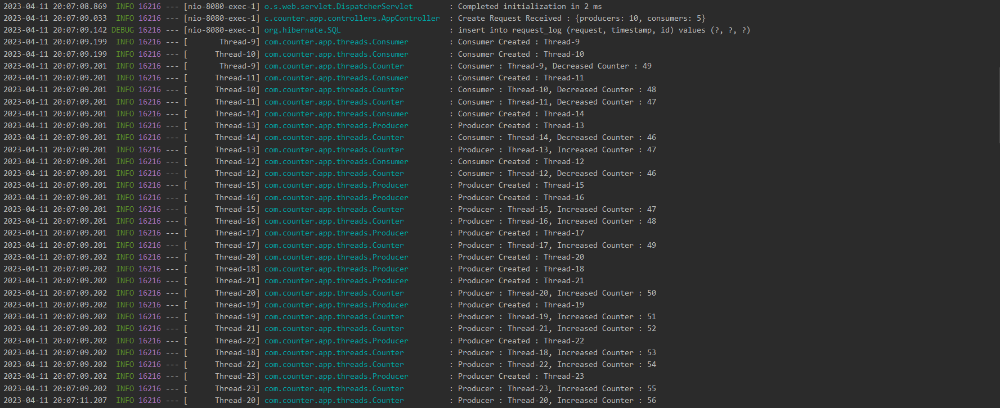
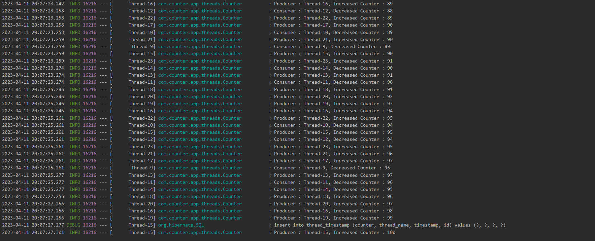
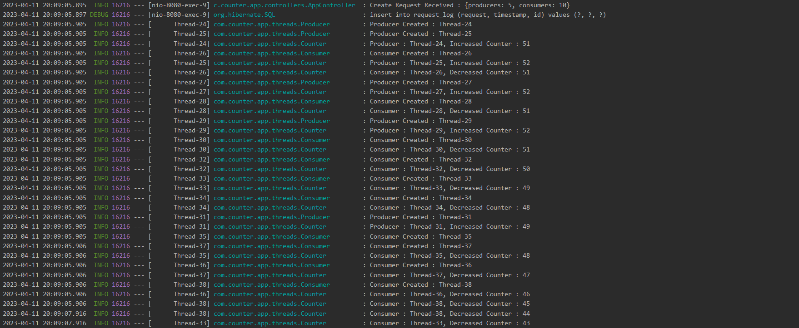
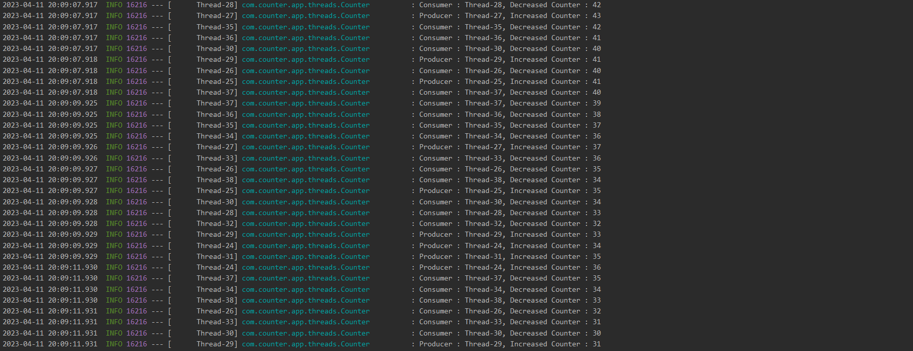

# Counter Service
This service demonstrate an example of multithreading and concurrency in Java Spring Boot with the help of
a simple counter whole value is updated by multiple parallel threads.

****
## Prerequisites
This service is build with and needs following dependencies and libraries in order to clone and run
1) Git
2) Java 11
3) Maven
4) Docker

## Steps
To run this service follow the below mentioned steps
1) Clone the git repository with the command<br/>
```git clone https://github.com/waleedhassan92/counter-service.git```
2) Build project using command<br/>
```mvn clean install```
3) Run the service in docker container by running command<br/>
```docker-compose up --build```

Once the application is running successfully then following logs will be seen


## Endpoints
This service has two endpoints
### 1. Create
The create endpoint creates multiple consumer and producer threads. Producer threads increase the value
of the counter and consumer thread decrease the value of the counter. These threads run until the value
of the counter becomes 0 or 100.

#### Request

```
curl --location 'http://localhost:8080/v1/create' \
--header 'Content-Type: application/json' \
--data '{
    "producers": 10,
    "consumers": 2
}'
```
#### Response

```
{
    "status": "Created",
    "message": "Threads created successfully"
}
```

If the number of producers is greater than the number of consumers then the counter reaches to 100 first
as shown in the images below





If the number of consumers is greater than the number of producers then the counter reaches to 0 first
as shown in the images below






The request is logged into a table in database `request_log`


When the counter reaches 0 or 100 the timestamp and thread name is also logged in database in table `thread_timestamp`


### 2. Reset
The reset endpoint reset the value of the counter to the value provided in the request parameter. This endpoint
is used specially when the counter value reaches 0 or 100. We have to reset the value to some other values
in order to make create endpoint work.

#### Request

```
curl --location --request POST 'http://localhost:8080/v1/reset?counter=50' \
--header 'Content-Type: application/json'
```

#### Response

```
{
    "status": "OK",
    "message": "Counter value set to 50"
}
```

****

## Conclusion
This is a simple application showing multithreading and concurrency in Java Spring Boot application.
It can be improved in by adding more and more functionality. Couple of improvements can be
1) Including flyway to handle db migrations
2) Using docker hub to push and pull docker images
3) Using Spring Boot Cloud configurations in order to get configurations remotely
4) Using API Gateway and Eureka to handle multiple instances of the application
5) Using Spring Security to secure the endpoints
